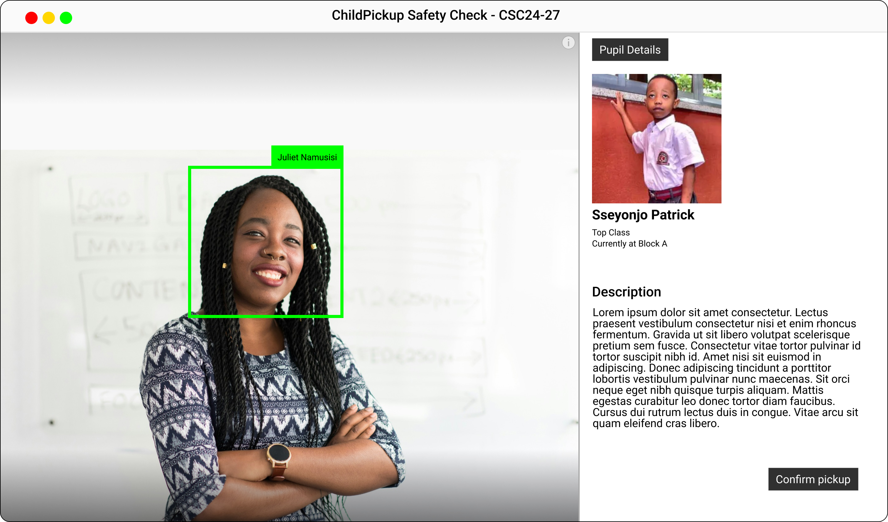

# Child-Pickups

Table A: Group Members
| SNo. | Names | Role |
| :--- | --- | --- |
| 1 | SSEMAKULA MARTIN | |
| 2 | NAGABA NORMAN | |
| 3 | KABOGGOZA RONNIE  | |
| 4 | KASASIRA CHARLES | |

This is a mono repo for the Child-Pickups

In this repo, you will find

/website

/system

/mobile-app

/dataset

/model

### Problem Statement
Majority of schools lack an automated system that can save time and uniquely identify children, parents, and any other relevant transportation provider that can pick up these children. The current manual verification methods have resulted in unauthorized individuals gaining access to children.

[Link to concept paper](https://childpickups.com)

[Link to Report](https://childpickups.com)

High Accuracy and Speed, We are using Facial Recognition to speed up child pickups in daycares and nursery schools..
We are making sure to see that convenience can still coexist with security, transforming user convenience, safety and security with facial recognition
